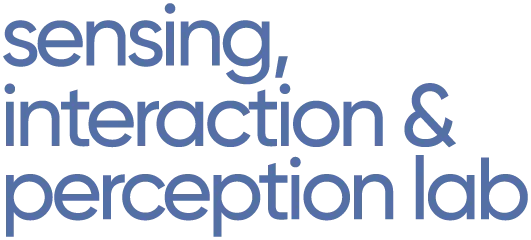

   &nbsp; &nbsp;
       

# CO2 Compensation Visualization, Group 16
#### Vikram Thanigaivelan, Student 2, Student 3, Student 4, Student 5, Student 6

## Project description

    This is our Affinity Board + Brainstroming + How Might We statements: https://miro.com/app/board/o9J_lt6od70=/?invite_link_id=852810933907
    Link to Research Google Doc:

  Introduction to chosen topic in own words, possibly with a brief motivation

## Ideation

    TODO
    
## Evaluation

    TODO

## Low-fidelity Prototype

    TODO
    
## Mid-fidelity Prototype

    TODO

## Hi-fidelity Prototype

    TODO
    
## User study

    TODO
